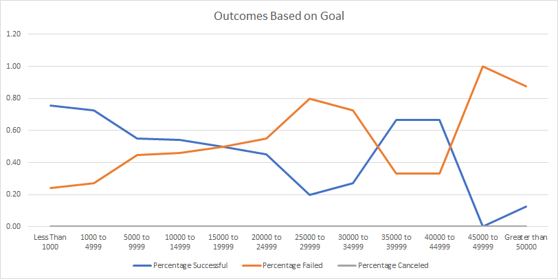

# RBCModule1-Challenge

## Overview of Project
This project exemplifies a basic analysis on a dataset from the crowd-funding website **Kickstarter.com**. In this scenario, our client *Louise* is planning to raise money for several theatre productions and in doing so, would like to "game the system", that is, she would like to determine the best timing to start a fundraising campaign and the best amount of funds to request from the crowd. Here best is defined as *Likelihood of Success Based on Historical Trends*.

# Analysis and Challenges
Our results are centered upon two data fields: the launch date of the campaign and the amount of funds requested, known as the campaign's "goal". 

## Launch Date Correlation
As seen in the graph below, a great many theatre campaigns were initiated in the month of May during the years of our dataset, however, this may be slightly deceiving in regards to success rates since we see the failure line of the graph nearly halfway between the success line and the x-axis throughout the graph. 

Indeed, some additional computation shows that the success rate in May was 66.8% which is the highest amongst the months but is worth comparing to April (62.8%), June (65.4%), and July (63.0%). When considering initiating her campaign, Louise should take into account these other months since there are reduced numbers of campaigns initiated during these months so it may be more likely that hers is not "lost in the weeds". 

## Outcomes based on Funding Goals
Our second summary is based on the amount of funds sought versus their success, see the graph below. 

As the reader can see, as the amount of funding requested increases, the success rate drops off dramatically. The success rate being greater than 50% for the values of *35000 to 39999* and *40000 to 44999* is effectively a statistical anomaly since we have so few data points (less than 10) for these categories past the $25,000 mark.

## Challenges to Completion
This analysis is done with very basic pivot table construction. The largest challenges that may present themselves in doing so are designing the table so that the x-axis are months of the campaigns. 

## Results
As written above, we recommend that Louise initate her campaign between the months of April and July with the most liklihood of success to be in May based on the historical trends. A second graph showing these success rates would be valuable. Further, we recommend that Louise avoid the months of December and January as their Success Rates are greatly diminished. 

 Based on the "Outcomes Based on Funding Goals" chart, we recommend that Louise seek no more than $15,000 or else risk failure. This "failure-avoidance" is especially important for Kickstarter.com funding since they stipulate that any venture that does not raise its capital (i.e. is not successful) will return the funds to the original funders.  

 One of the biggest limitations to this analysis as done is that we do not take into account the "seriousness / realisticness" of funding requests. In essence, many people are likely to ask for money from a crowd since it costs nothing to do so and thus we may have many outliers or skewing factors. One way to evaluate this seriousness credential would be to evaluate campaigns that received say more than 5% of their requested funds. If they did not, then it is likely that the crowd deemed the request outlandish and so should be considered in a different category than a typical "failure".
